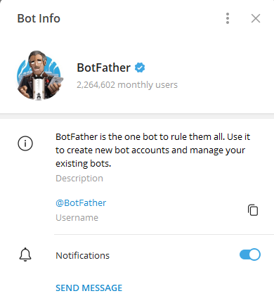
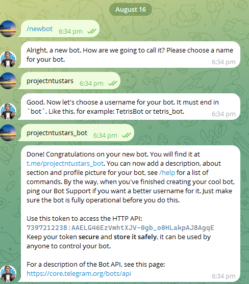
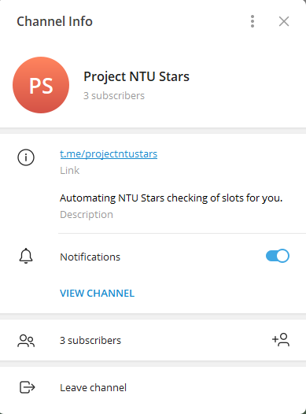
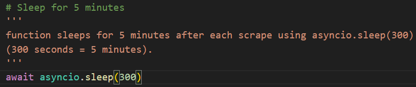
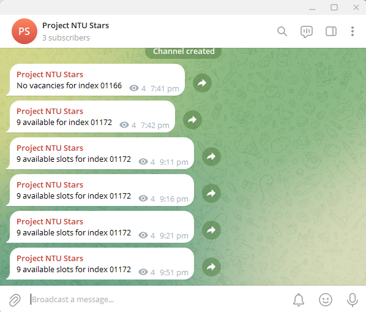

# Project NTU STARS

Using Jupyter Notebook and Python 3.7

## Problem Statement
To help NTU students arrange their modules and classes efficiently with NTU STARS.

Students of Nanyang Technological University have always faced the issue of having to 'camp' on the school website (NTU STARS), to wait for vacancies for the class slots they want, due to it being first-come-first-serve. As such, having to constantly be on the NTU STARS website to refresh and check for slot timings for the classes they want is an inconvenience at the start of every semester.

This program seeks to provide a solution to this problem by automating the process of logging into the school website to check for available vacancies for the class timings they want, and to streamline that process into notifications into their own Telegram channel, due to the popularity of Telegram as a social media platform for NTU students.

## How does this program work?

This program works by using the Telegram API to periodically send out the number of class vacancies for the chosen module index to a Telegram channel using a Telegram bot. The retrieval of this class vacancies is done by automating the login to NTU STARS website, and selecting the module and the 'Change Index' option, which will lead us to the "Swap Index" page where we can find the class index that we want and their respective vacancies.

This script requires the installation of numerous applications as well as python libraries.

Firstly, a [chrome driver](https://googlechromelabs.github.io/chrome-for-testing/#stable) with a version the same as the Chrome application installed on your computer should be downloaded. You can find the folder containing the chrome driver in this repository as well titled **"chromedriver-win64"**. A path in your file explorer/finder to the location of the chrome driver should be initialized in the code.

What this chrome driver does is that it simulates an actual user opening Chrome, logging in to the school website, and retrieving the information. Every time the code is run, this chrome driver will open up a new browser to login into the school's website, and retrieve the relevant information (the number of vacancies for your module), and broadcast it to your Telegram channel, using a Telegram Bot. 

Before this can be done, we need to install a few Python libraries required for the running of this Python program. THey can be downloaded by running the command-line arguments in the terminal:

`pip install [library name]`

This should be done for the following python libraries: **selenium** and **telegram**.

Afterwards, you should be good to go!

## How can we use this program?

### 1. Creating Telegram Bot
First, we will need to set up a Telegram bot that will be in charge of sending the automated messages to your Telegram channel. This can be done by searching up the "BotFather" bot on Telegram, and setting up your bot through the following commands: **"/start", "/newbot", "{bot name}", "{bot username}"**, as per the documentation below:

 

Do remember to copy the **bot token** as we will need it later.

### 2. Creating Telegram Channel

Once we have done that, we need to create a Telegram Channel for yourself, and add your bot to the channel, giving it administrative rights.

We will then need to copy the **channel ID**, which will be the unique ID of the channel, i.e. what's behind "t.me/" in the channel link. In my case, my channel ID is "projectntustars".

### 3. Setting up the python script

Now that we have set up the Telegram bot and channel, we should now set up the python script which the program will run on.

What we need to do is to edit the script with the relevant information:
1. Chrome Driver path (copy the path of the chromedriver.exe application)
2. Bot Token (with the Telegram bot token of your bot we have saved earlier)
3. Chat ID (with the Telegram Chat ID we have saved earlier)
4. Frequency of checking slots (default is 5 minutes, see below for where to change this code)

### 4. And voila! time to run the script!

Now it's time to run the script! Upon running the script each time, you will be prompted with your login details (username, password), and the indexes you wish to check and swap (old index, new index). You will not need to input your course code for the module you wish to swap, unless there are two modules with the same indexes, which is where this code will not work.

You will need to key in these details above every time you run the script (i.e. 5 minutes), but not every time the scraping of information occurs. This means that if you run the script on your terminal, it will scrape the information on NTU STARS website every 5 minutes, and you only need to key in the details at the start. You will only need to re-key in your details if you terminate the program and re-run it again.

### Final Result!

## Cons and improvements to this program

### 1. Not automating the changing of slots, but just periodically notifying you of the vacant slots for your desired class index
This program only seeks to inform you of vacant slots in your desired module index, and does not help you to actually make the changes. A reason why I did not implement this next step is because changing your module index is a very sensitive action, where we do not want any potential errors and change the wrong index, which will not be reversible if there are no empty slots in the original index.

Do let me know if you would like me to improve the program as above which will help to automate the process entirely. You can let me know on Telegram @uneasymoneysniper.

### 2. Program is only functional from 10:30am to 10:00pm every day, for when the add-drop period is open each day
This program is only able to run during the add-drop period each day from 10:30am to 10:00pm, when the site allows you to check for slots and make the add-drop adjustments to your classes.

### 3. Program does not check the course code
This will affect the results of the index slots if there are two modules you have registered with the same index, although unlikely. This is because the program only checks for the unique index, and not the course code.

### 4. Program can only be run locally on your computer
This program can only be run from your laptop locally, from the terminal, which might take up computing resources and make your laptop slow. However, the alternative which is running this program on an online server without your laptop's computing resources will cost money.

## Disclosures
This program does not in any way, shape or form, store your user data such as username and password.
